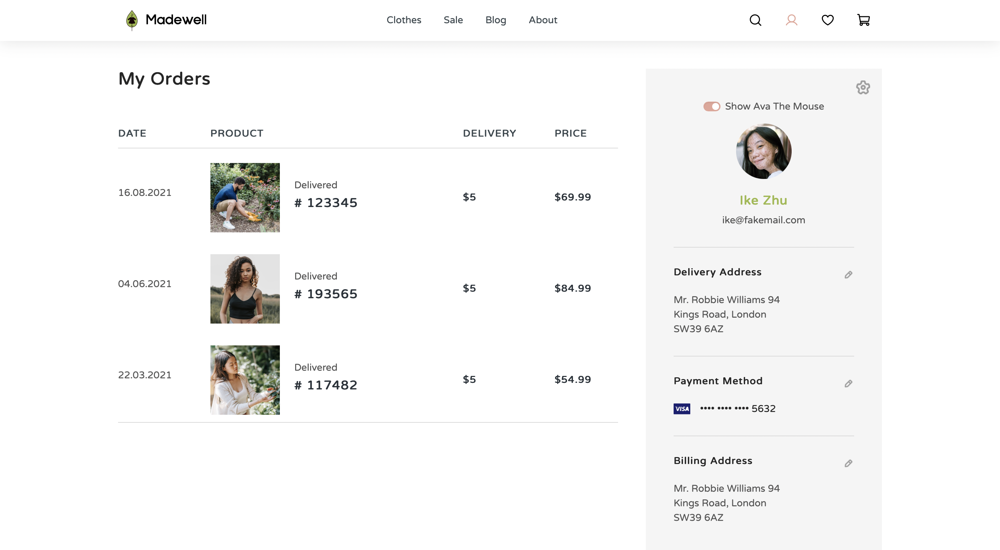
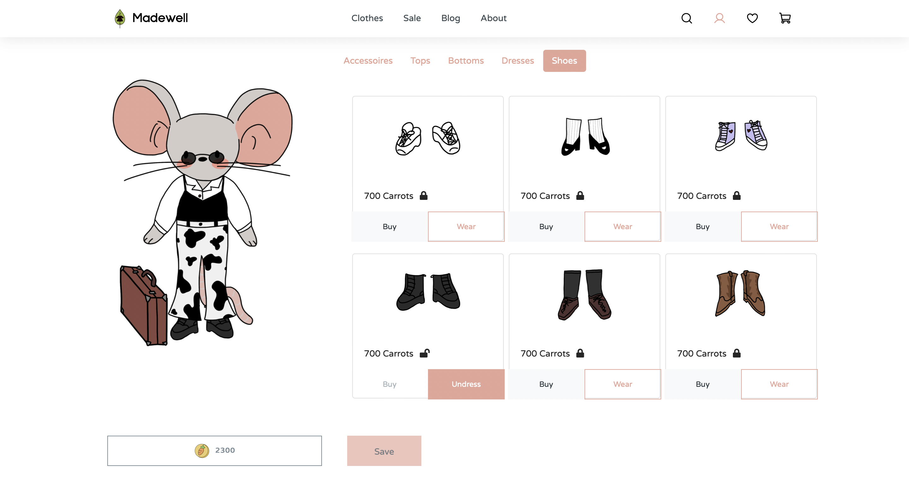
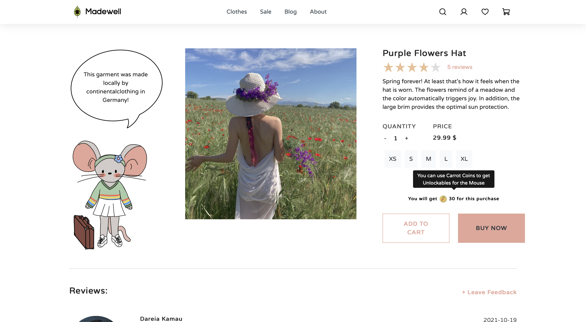

# Madewell

Madewell's ecommerce website includes an avatar - Ava The Mouse - which displays information about the products and the company and can be dressed and thus personalized.

- See details of the clothes
- Dress the avatar according to your taste
- Earn the ingame currency Carrot Coins
- Collect all unlockables

## Table of content
- [Pages](#pages)
- [Usage](#usage)
- [Screenshots](#screenshots)
- [Requirements](#requirements)
- [Installation Instructions](#installation-instructions)
- [Tech Stack](#tech-stack)
- [License](#license)

## Pages

- Landing Page
- Shop
- Sale
- Blog
- About
- Specific Product
- Avatar Dress-Up
- Profile
- Wishlist
- Shopping Cart
- Contact
- FAQ

## Usage

All you need to start the [website](https://madewell.herokuapp.com/) is a browser. Any modern browser, like Safari, Mozilla Firefox or Google Chrome, works.

## Screenshots
&nbsp;
&nbsp;
&nbsp;

## Requirements

- Node 16.8
- Posgres 13.4

## Installation Instructions

### Frontend

These instructions show how to run the Frontend locally.

<b>Show instructions</b>

  
  ##### Install local dependencies:
- `yarn install`
  
  ##### Run the application:
- `yarn start`
  
  Open [http://localhost:3000](http://localhost:3000) with your browser to see the result.
  

  

### Backend

This is how to run the Backend locally.

<b>Show instructions</b>

  
  
  ##### Install local dependencies:
- `yarn install`

------------

##### Adjust local db:
  
###### 1.  Install postgres:
 - MacOS:
   - `brew install postgres`

- Ubuntu:
  - `sudo apt update`
  - `sudo apt install postgresql postgresql-contrib`

###### 2. Create db and admin user:
 - Before run and test connection, make sure you have created a database as described in the above configuration. You can use the `psql` command to create a user and database.
   - `psql -U postgres`

- Type this command to creating a new database.
  - `postgres=> CREATE DATABASE development OWNER postgres;`
  - `postgres=> \q`
 
 ------------

 ##### Setup database tables:
 - `yarn reset`
 
 ##### Start development build:
 - `yarn start:dev`

 ##### Start production build:
 - `yarn start`
  

## Tech Stack

### Frontend Stack

- [Next.js](https://nextjs.org)
- [Redux](https://redux.js.org)
- [React Bootstrap](https://react-bootstrap.github.io)
- [Sass](https://sass-lang.com)
- [Font Awesome](https://fontawesome.com)

### Backend Stack

- [PostgreSQL](https://www.postgresql.org)
- [NodeJS](https://nodejs.org/en/)  
- [ExpressJS](https://expressjs.com/)  

## License

Madewell is released under the [MIT License](/LICENSE).
